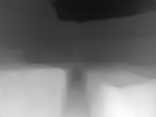

UNDER DEVELOPMENT

https://www.youtube.com/watch?v=HuU53ivwpEA

This is the python3 version of Hourglass model used by megadepth implemented in tf Keras.

python3 inference_mega_tensorflow.py

input

output

our output

